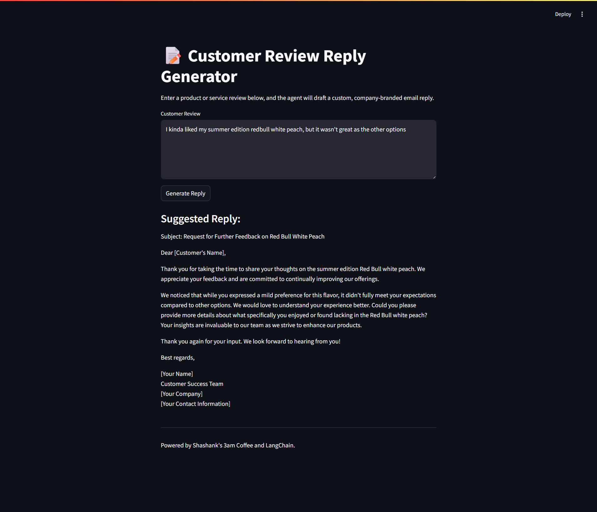

# Customer Review Reply Generator

A Streamlit app that uses LangChain + OpenAI (GPT-4o-mini) to automatically draft company-branded email replies to customer feedback.

## Features

- **Sentiment classification** (positive / negative / neutral / escalate)  
- **Dynamic branching** into custom reply templates  
- **Streamlit UI** for one-click generation  

## Demo



## Installation

1. **Clone** this repo  
   ```bash
   git clone https://github.com/shashanks33/Customer_Review_Custom_Response_Agent.git
   cd Customer_Review_Custom_Response_Agent
   ```

2. **Create** a virtual environment & **install** dependencies

   ```bash
   python3 -m venv .venv
   source .venv/bin/activate    # or .venv\Scripts\activate on Windows
   pip install -r requirements.txt
   ```

3. **Configure** your OpenAI key
   Create a `.env` or rename `.env.example` to `.env` in the project root with:

   ```bash
   OPENAI_API_KEY=your_api_key_here
   ```

4. **Run** the app

   ```bash
   streamlit run app.py
   ```

## Usage

* Paste or type a customer review into the text box
* Click **Generate Reply**
* Copy/paste the suggested email into your support workflow

## Requirements

See [requirements.txt](./requirements.txt) for exact versions.
